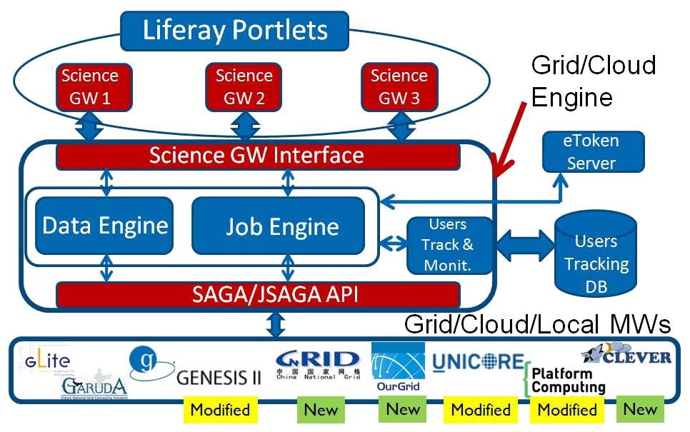

*******************
GRID & CLOUD ENGINE
*******************

============
About
============

The **Catania Grid & Cloud Engine** is a standard based middleware independent JAVA library that provides several APIs to submit and manage jobs on *Distributed Computer Infrastructures* (DCI). It is compliant with the **Open Grid Forum** (`OGF <https://www.ogf.org/>`_) **Simple API for Grid Applications** (`SAGA <https://www.ogf.org/documents/GFD.90.pdf>`_) standard. 

The Catania Grid & Cloud Engine provides a standard way to interact with different DCI middlewares, so the developers can develop their applications without worrying about the details of the infrastructures where those applications will be performed.

The `Figure 1`_ shows the Catania Grid & Cloud Engine architecture, that consists of:

- two interfaces:    
    - **Science GW interface**: towards the applications;
    - **DCI interface**: towards the DCI middlwares based on the SAGA Standard;

- three modules:
    - **Job Engine Module**: to manage jobs;
    - **Data Engine Module**: to move data towards/from the DCIs
    - **User Track & Monitoring Module**: to store information about the users interactions in the  usertracking database.
    
.. _Figure 1:

   
   Figure 1. Catania Grid & Cloud Engine Architecture
   
Job Engine 
----------

The *Job Engine*, one of the core component of the Catania Grid & Cloud Engine, is made of a set of libraries to develop applications able to submit and manage jobs on DCI. As said before, it is compliant with the OGF SAGA standard, and in particular adopts the JSAGA, an JAVA implementation of the SAGA standard, made by the `CCIN2P3 <http://grid.in2p3.fr/jsaga/>`_.
It is optimized to be used in a Web Portal running an application server (e.g. Glassfish, Tomcat,…) based on J2EE, but can be also used also in stand-alone mode.

The Job Engine main features are:

- *Easiness*: the Job Engine allows to develop applications able to submit jobs on a DCI in a very short time, exposing a set of very intuitive APIs. The developer has only to submit the job:
    - the Job Engine periodically checks the job status;
    - when the job ends, the output will be automatically downloaded and (if set) an email will sent to notify the user.
- *Scalability*: the Job Engine is able to manage a huge number of parallel job submissions fully exploiting the HW of the machine where it is installed. A burst of parallel job submission will be enqueued and served according the hardware capabilities.
- *Perfomance*: delays due to grid interactions are hidden to the final users, because the Job Engine provide asynchronous functions for each job management actions. 
- *Accounting*: the Job Engine provides an accounting system fully compliant with EGI VO Portal Policy and EGI Grid Security Traceability and Logging Policy.
- *Fault tollerance*: the Job Engine implements an advanced mechanism to ensure job submission and automatic re-submission mechanisms when a job fails for infrastructure related issues.

============
Installation
============

To install the Catania Grid & Cloud Engine first of all you have to create the Usertracking database where users interactions will be stored.

1. Download the SQL scripts from `here <https://raw.githubusercontent.com/csgf/grid-and-cloud-engine/master/UsersTrackingDB/UsersTrackingDB.sql>`_ and performs the following command:

.. code:: bash
    
    mysql -u root -p < UsersTrackingDB.sql

2. Download Grid Engine and JSAGA libraries from `this link <http://sourceforge.net/projects/ctsciencegtwys/files/catania-grid-engine/1.5.9/Liferay6.1/GridEngine_v1.5.9.zip>`_.

3. Unzip the GridEngine_v1.5.9.zip:

.. code:: bash

    unzip GridEngine_v1.5.9.zip

4. Copy the extracted lib dependencies folder under the application server /lib folder:

.. code:: bash

    cp -r lib /opt/glassfish3/glassfish/domains/liferay/lib/

============
Usage
============

============
References
============

============
Contributors
============

    Diego SCARDACI

    Mario TORRISI

.. Please feel free to contact us any time if you have any questions or comments.

.. _INFN: http://www.ct.infn.it/
.. _DFA: http://www.dfa.unict.it/
.. _ARN: http://www.grid.arn.dz/

.. :Authors:

.. `Mario TORRISI <mailto:mario.torrisi@ct.infn.it>`_ - University of Catania (DFA_),

.. `Antonio CALANDUCCI <mailto:antonio.calanducci@ct.infn.it>`_ - Italian National Institute of Nuclear Physics (INFN_),
