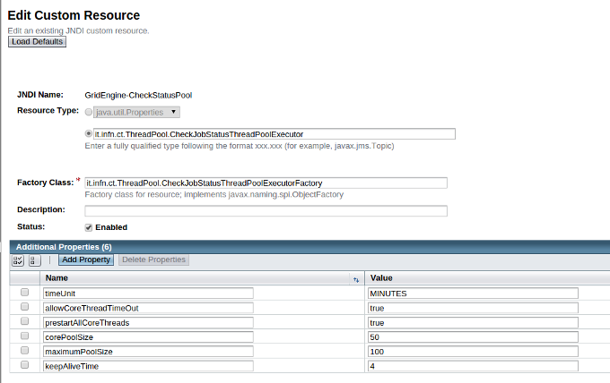
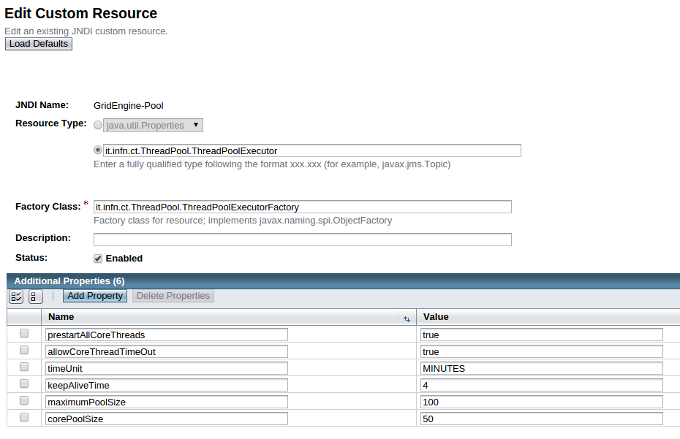
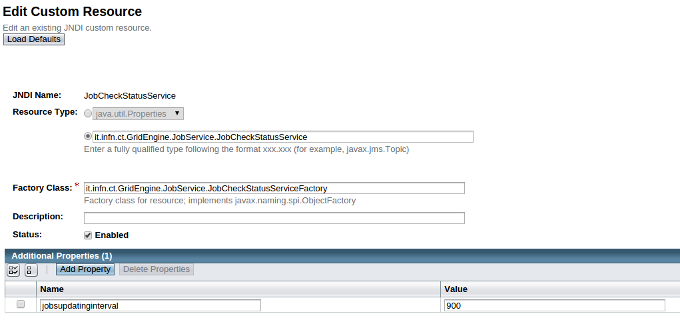
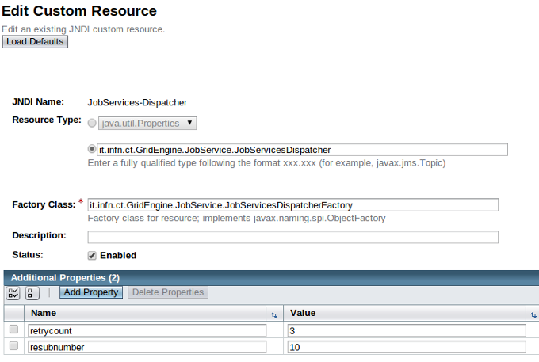
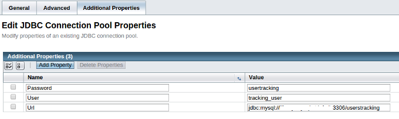
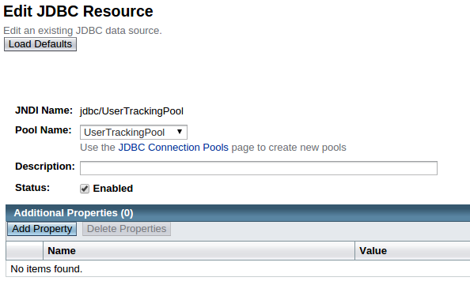
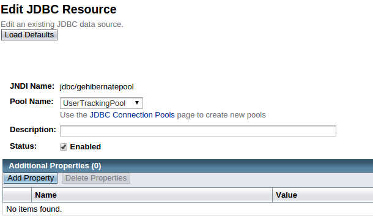

*******************
GRID & CLOUD ENGINE
*******************

============
About
============

.. image:: images/logo.png
   :align: left
   :scale: 70%
   :target: https://github.com/csgf/grid-and-cloud-engine

-------------

The **Catania Grid & Cloud Engine** is a standard based middleware independent JAVA library that provides several APIs to submit and manage jobs on *Distributed Computer Infrastructures* (DCI). It is compliant with the **Open Grid Forum** (`OGF <https://www.ogf.org/>`_) **Simple API for Grid Applications** (`SAGA <https://www.ogf.org/documents/GFD.90.pdf>`_) standard. 

The Catania Grid & Cloud Engine provides a standard way to interact with different DCI middlewares, so the developers can develop their applications without worrying about the details of the infrastructures where those applications will be performed.

The `Figure 1`_ shows the Catania Grid & Cloud Engine architecture, that consists of:

- two interfaces:    
    - **Science GW interface**: towards the applications;
    - **DCI interface**: towards the DCI middlwares based on the SAGA Standard;

- three modules:
    - **Job Engine Module**: to manage jobs;
    - **Data Engine Module**: to move data towards/from the DCIs
    - **User Track & Monitoring Module**: to store information about the users interactions in the  usertracking database.
    
.. _Figure 1:

.. figure:: images/CT-G&C-E.png
   :align: center
   :alt: G&CE
   :scale: 60%
   :figclass: text    
   
   Catania Grid & Cloud Engine Architecture
   
Job Engine 
----------

The *Job Engine*, one of the core component of the Catania Grid & Cloud Engine, is made of a set of libraries to develop applications able to submit and manage jobs on DCI. As said before, it is compliant with the OGF SAGA standard, and in particular adopts the JSAGA, an JAVA implementation of the SAGA standard, made by the `CCIN2P3 <http://grid.in2p3.fr/jsaga/>`_.
It is optimized to be used in a Web Portal running an application server (e.g. Glassfish, Tomcat,…) based on J2EE, but can be also used also in stand-alone mode.

The Job Engine main features are:

- *Easiness*: the Job Engine allows to develop applications able to submit jobs on a DCI in a very short time, exposing a set of very intuitive APIs. The developer has only to submit the job:
    - the Job Engine periodically checks the job status;
    - when the job ends, the output will be automatically downloaded and (if set) an email will sent to notify the user.
- *Scalability*: the Job Engine is able to manage a huge number of parallel job submissions fully exploiting the HW of the machine where it is installed. A burst of parallel job submission will be enqueued and served according the hardware capabilities.
- *Perfomance*: delays due to grid interactions are hidden to the final users, because the Job Engine provide asynchronous functions for each job management actions. 
- *Accounting*: the Job Engine provides an accounting system fully compliant with EGI VO Portal Policy and EGI Grid Security Traceability and Logging Policy.
- *Fault tollerance*: the Job Engine implements an advanced mechanism to ensure job submission and automatic re-submission mechanisms when a job fails for infrastructure related issues.

============
Installation
============

To install the Catania Grid & Cloud Engine first of all you have to create the Usertracking database where users interactions will be stored.

1. Create the userstracking database using the following commnad:

.. code:: bash
    
    mysql -u root -p 
    
.. code:: sql

    mysql> CREATE DATABASE userstracking;

2. Download the SQL scripts from `here <https://raw.githubusercontent.com/csgf/grid-and-cloud-engine/master/UsersTrackingDB/UsersTrackingDB.sql>`_ and performs the following command to create the empty schema:

.. code:: bash
    
    mysql -u root -p < UsersTrackingDB.sql

Then you need to download and configure the Catania Grid & Cloud Engine dependencies. 

1. Download the GridEngine_v1.5.10.zip from `this link <http://grid.ct.infn.it/csgf/binaries/GridEngine_v1.5.10.zip>`_

2. Unzip the GridEngine_v1.5.9.zip

.. code:: bash

    unzip GridEngine_v1.5.9.zip

3. Copy the extracted lib folder under the application server /lib folder:

.. code:: bash

    cp -r lib /opt/glassfish3/glassfish/domains/liferay/lib/

4. Download the attached GridEngineLogConfig.xml (`link <https://raw.githubusercontent.com/csgf/grid-and-cloud-engine/master/config/GridEngineLogConfig.xml>`_), and move this file to the Liferay config folder:

.. code:: bash
    
    mv GridEngineLogConfig.xml \ 
    /opt/glassfish3/glassfish/domains/liferay/config
    
5. Restart Glassfish server

.. code:: bash
  
    /opt/glassfish3/bin asadmin-stop liferay     
    /opt/glassfish3/bin asadmin-start liferay
    
When the start process ends load the Glassfish Web Administration Console: http://sg-server:4848, fill with username liferayadmin and the password you set for the glassfish administrator and create the required resources. 

JNDI Resources
--------------

Select `Resources -> JNDI -> Custom Resources` from left panel. Then on the right panel you can create the resources by clicking the **New...** button.

1. Create **GridEngine-CheckStatusPool** with the following parameters (`Figure 2`_):
    - **JNDI Name**: GridEngine-CheckStatusPool;
    - **Resource Type**: it.infn.ct.ThreadPool.CheckJobStatusThreadPoolExecutor
    - **Factory Class**: it.infn.ct.ThreadPool.CheckJobStatusThreadPoolExecutorFactory
    - **Additional Properties**:
        - **corePoolSize**: 50
        - **maximumPoolSize**: 100
        - **keepAliveTime**: 4
        - **timeUnit**: MINUTES
        - **allowCoreThreadTimeOut**: true
        - **prestartAllCoreThreads**: true

.. _Figure 2:

   
   GridEngine-CheckStatusPool JNDI Resource
   

2. Create **GridEngine-Pool** with the following parameters `Figure 3`_):
    - **JNDI Name**: GridEngine-Pool;
    - **Resource Type**: it.infn.ct.ThreadPool.ThreadPoolExecutor
    - **Factory Class**: it.infn.ct.ThreadPool.ThreadPoolExecutorFactory
    - **Additional Properties**:
        - **corePoolSize**: 50
        - **maximumPoolSize**: 100
        - **keepAliveTime**: 4
        - **timeUnit**: MINUTES
        - **allowCoreThreadTimeOut**: true
        - **prestartAllCoreThreads**: true

.. _Figure 3:

   
   GridEngine-Pooll JNDI Resource
   
3. Create **JobCheckStatusService** with the following parameters (`Figure 4`_):
    - **JNDI Name**: JobCheckStatusService;
    - **Resource Type**: it.infn.ct.GridEngine.JobService.JobCheckStatusService
    - **Factory Class**: it.infn.ct.GridEngine.JobService.JobCheckStatusServiceFactory
    - **Additional Properties**:
        - **jobsupdatinginterval**: 900

.. _Figure 4:

   
   JobCheckStatusService JNDI Resource

4. Create **JobServices-Dispatcher** with the following parameters:
    - **JNDI Name**: JobServices-Dispatcher;
    - **Resource Type**: it.infn.ct.GridEngine.JobService.JobServicesDispatcher
    - **Factory Class**: it.infn.ct.GridEngine.JobService.JobServicesDispatcherFactory
    - **Additional Properties**:
        - **retrycount**: 3;
        - **resubnumber**: 10;
        - **myproxyservers**: gridit=myproxy.ct.infn.it; prod.vo.eu-eela.eu=myproxy.ct.infn.it; cometa=myproxy.ct.infn.it; eumed=myproxy.ct.infn.it; vo.eu-decide.eu=myproxy.ct.infn.it; sagrid=myproxy.ct.infn.it; euindia=myproxy.ct.infn.it; see=myproxy.ct.infn.it;

.. _Figure 5:

   
   JobServices-Dispatcher JNDI Resource

Now you have to create the required JDBC Connection Pools. Select `Resources -> JDBC -> JDBC Connection Pools` from left panel. On the right panel you can create the resources by clicking the **New...** button.

- Create **UserTrackingPool** with the following parameters:
    - General Settings (Step 1/2) see `Figure 6`_:
        - **Pool Name**: usertrackingPool
        - **Resource Type**: select javax.sql.DataSource
        - **Database Driver Vendor**: select MySql
        - Click Next
    - Advanced Settings (Step 2/2) `Figure 7`_:
       - Edit the default parameters in **Pool Settings** using the following values:
            - **Initial and Minimum Pool Size**: 64
            - **Maximum Pool Size**: 256
       - Select all default Additional properties and delete them
            - Add the following properties:
            
        =====  =====
        Name   Value
        =====  =====
        Url    jdbc:mysql://`sg-database`:3306/userstracking
        User   tracking_user
        False  usertracking
        =====  =====
       
       - Click Save

Please pay attention to the Url property, **sg-database** should be replaced with the correct Url of your database machine.
You can check if you have correctly configured the Connection Pool by clicking on Ping button,  you should see the message **Ping Succeded**, otherwise please check your configuration.

.. _Figure 6:

.. figure:: images/UsersTrackingPool.png
   :align: center
   :alt: JobServices-Dispatcher
   :scale: 80%
   :figclass: text    
   
   UsersTrackingPool JDBC General settings
   
.. _Figure 7:

   
   UsersTrackingPool JDBC Advanced settings

Finally, you have to create the required JDBC Resources. Select `Resources -> JDBC -> JDBC Resources` from left panel. On the right panel you can create the resources by clicking the **New...** button.

- Create **jdbc/UserTrackingPool** with the following parameter (`Figure 8`_):
    - **JNDI Name**: jdbc/UserTrackingPool;
    - **Pool name**: select usertrackingPool.

.. _Figure 8:

   
   jdbcUsersTrackingPool JDBC Resource

- Create **jdbc/gehibernatepool** with the following parameter `Figure 9`_:
    - **JNDI Name**: jdbc/gehibernatepool;
    - **Pool name**: select usertrackingPool.

.. _Figure 9:

   
   jdbcgehibernatepool JDBC Resource

Now, restart glassfish to save the resources.
    
============
Usage
============

Once you have successfully installed and configured the Catania Grid & Cloud Engine, to exploit all its features you could download and deploy one of ours portlets available on the `GitHub csgf repository <https://github.com/csgf>`_. As an example you could referer to the `mi-hostname-portlet <https://github.com/csgf/mi-hostname-portlet>`_ to get info in how to install and use this portlet. 

.. ============
.. References
.. ============

============
Contributors
============

    Diego SCARDACI

    Mario TORRISI

.. Please feel free to contact us any time if you have any questions or comments.

.. _INFN: http://www.ct.infn.it/
.. _DFA: http://www.dfa.unict.it/
.. _ARN: http://www.grid.arn.dz/

.. :Authors:

.. `Mario TORRISI <mailto:mario.torrisi@ct.infn.it>`_ - University of Catania (DFA_),

.. `Antonio CALANDUCCI <mailto:antonio.calanducci@ct.infn.it>`_ - Italian National Institute of Nuclear Physics (INFN_),
